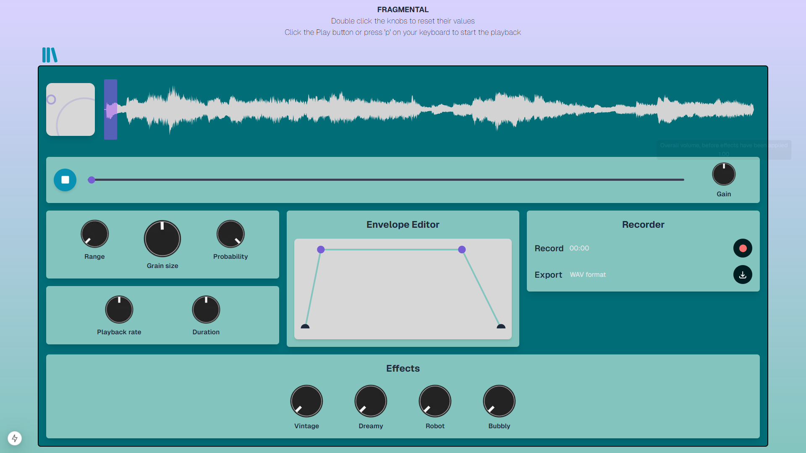
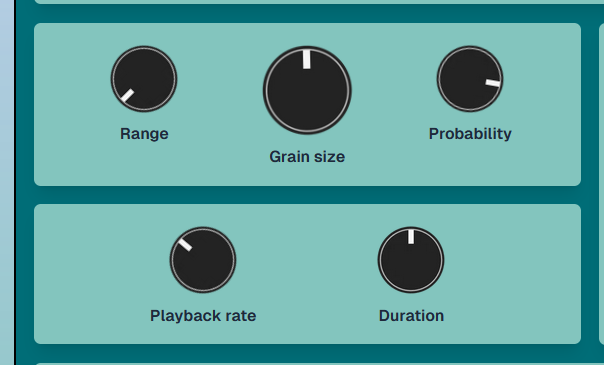
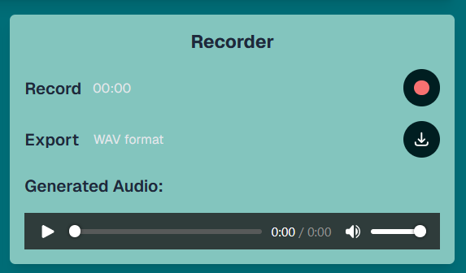

## What is Fragmental?
Fragmental is a web-based granular synthesizer that allows users to explore granular synthesis creatively without requiring deep technical knowledge.

## What is granular synthesis?
Granular synthesis is a sound processing technique that involves splitting audio into small 'grains' and manipulating them to create new textures, tones, and effects. It's widely used in music production and sound design.



## Cut the chatter, let's get to it
There are two ways to begin exploring Fragmental. The first option involves using the dropzone, where you can upload your own sample to the synthesizer. If you doubt which sample to use, we recommend trying pads, sounds with smooth transitions or longer chords. If you prefer to dive right in or don’t have your own sample collection, no problem — you can pick one from the library!


## Hit play and let magic happen 
At the top of the screen you can interact with the uploaded sample via a waveform window and a slider. The position of the slider indicates a grain from which a playback is started. It is basically a pivot point for all the next algorithms in audio processing.
For making the user experience more fun and interactive, the visual effect window on the left was added. It shows the grain behaviour, synced with the playback. 


## Knobs rack 
On the left of the page the knobs rack is located. It is splitted in two parts. The one above is responsible for the grain settings, one below is responsible for the playback rate and duration of each grain. 
- Range - range for selecting grains.
- Grain size - length of each grain, also affecting the total number of grains
- Probability - how likely is for every individual node to be skipped
- Playback rate - describes how fast are grains played one after the other
- Duration - how long each grain plays for



## Envelope
Envelope is used to shape and control how a sound velocity behaves. For this project ADSR envelope was used.  
- Attack: the time it takes for the sound to reach its maximum level after being triggered;
- Decay: the time it takes for the sound to drop from its peak level to a sustain level;
- Sustain: the level at which the sound remains while the note is held;
- Release: the time it takes for the sound to fade out to silence after the note is released.


## Recorder 
If you want to export a result to your favourite DAW or just show what you did to your friends, there's a Recorder made just for you! Hit record and then export. Light and simple.



## Effects
On the bottom part of the page is located the Effect Rack.
The knobs presented control a combination of multiple simple effects, like reverb, delay, distortion, etc...
The composite effects created until now are:
- Vintage (Low-pass, Bitcrusher, Reverb), for a lo-fi analog vibe;
- Dreamy (High-pass, Chorus, Reverb, Delay), for an ethereal feeling with a dragged sound;
- Robot (Autofilter, Distortion, Plate Reverb), for adding an electric and resonating layer;
- Bubbly (Phaser, Tremolo), for a funky and wobbly effect.


## If you want to run the app locally

Install the necessary dependencies (if needed):
```bash
npm install next react react-dom
npm install
```
Run the development server:

```bash
npm run dev
```

Open [http://localhost:3000](http://localhost:3000) with your browser to see the result.

Docs:
https://react-dropzone.js.org/
https://wavesurfer.xyz/docs/


## Dependencies 
- Tone.js
- Next.js
- React + Node.js
- Wavesurfer library
- Firebase 

